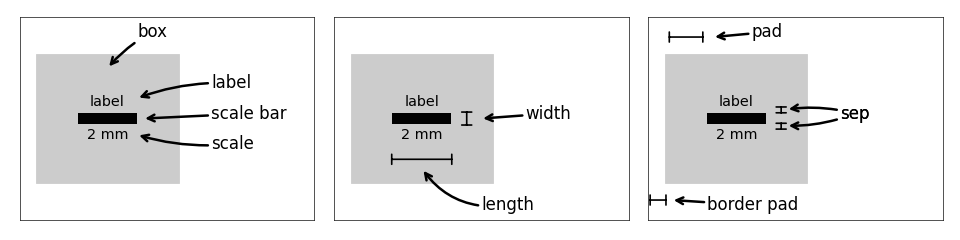
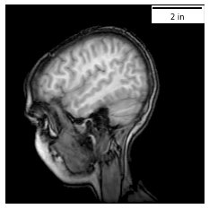
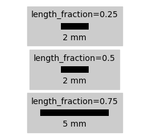
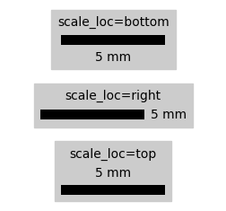
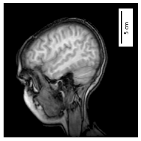
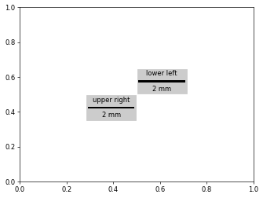

# matplotlib-scalebar


---

**Documentation**: See below

**Source Code**: https://github.com/ppinard/matplotlib-scalebar

**Cheat sheet**: https://kolibril13.github.io/plywood-gallery-matplotlib-scalebar

---

Provides a new artist for [matplotlib](https://matplotlib.org) to display a scale bar, aka micron bar.
It is particularly useful when displaying calibrated images plotted using
`plt.imshow(...)`.


The artist supports customization either directly from the **ScaleBar** object or from the matplotlibrc.

## Installation

Easiest way to install using `pip`:

```bash
pip install matplotlib-scalebar
```

For development installation from the git repository:

```bash
git clone git@github.com:ppinard/matplotlib-scalebar.git
cd matplotlib-scalebar
pip install hatch
hatch env create
hatch run test
```


## Getting started

There are many ways to customize the scale bar.
Examples and explanations of the arguments of the **ScaleBar** class are given [below](#scalebar-arguments), but here is a quick start guide.

The constructor arguments *dx* and *units* specify the pixel dimension.
For example `ScaleBar(0.2, 'um')` indicates that each pixel is equal to 0.2 micrometer.
By default, the scale bar uses SI units of length (e.g. m, cm, um, km, etc.).
See examples below for other system of units.

In this example, we load a sample image from the matplotlib library, create a subplot, plot image, create scale bar and add scale bar as an "artist" of the subplot.

```python
import numpy as np
import matplotlib.pyplot as plt
import matplotlib.cbook as cbook
from matplotlib_scalebar.scalebar import ScaleBar

# Load image
with cbook.get_sample_data("s1045.ima.gz") as dfile:
    im = np.frombuffer(dfile.read(), np.uint16).reshape((256, 256))

# Create subplot
fig, ax = plt.subplots()
ax.axis("off")

# Plot image
ax.imshow(im, cmap="gray")

# Create scale bar
scalebar = ScaleBar(0.08, "cm", length_fraction=0.25)
ax.add_artist(scalebar)

# Show
plt.show()
```


## Cheat Sheet

An example gallery for the matplotlib-scalebar package:
https://kolibril13.github.io/plywood-gallery-matplotlib-scalebar/


## Tips

### Save image in original resolution

The code snippet below shows how to save an image (stored in variable `arr`) in the same resolution as the original image without any horizontal and vertical axes.

```python
dpi = 200
fig = plt.figure(figsize=(arr.shape[1] / dpi, arr.shape[0] / dpi), frameon=False, dpi=dpi)

ax = fig.add_axes([0.0, 0.0, 1.0, 1.0])
ax.set_axis_off()

ax.imshow(arr)

scalebar = ScaleBar(100, "nm", length_fraction=0.25, location="lower right")
ax.add_artist(scalebar)

fig.savefig("original_resolution.png", dpi=dpi)
```

### Information about the drawn scale bar

After the scale bar has been drawn, the `info` property returns the following dataclass.

```python
@dataclasses.dataclass
class ScaleBarInfo:
    length_px: int
    value: float
    units: str
    scale_text: str
    window_extent: matplotlib.transforms.Bbox
```

Note that the `info` property returns a `ValueError` exception if the scale bar has not been drawn.

```python
fig, ax = plt.subplots()

scalebar = ScaleBar(0.08, "cm", length_fraction=0.25)
ax.add_artist(scalebar)

print(scalebar.info) # raises a ValueError exception

fig.canvas.draw()

print(scalebar.info) # works
```

## ScaleBar arguments

Here are arguments of the **ScaleBar** class constructor and examples how to use them.

```python
scalebar = ScaleBar(
        dx,
        units="m",
        dimension="si-length",
        label=None,
        length_fraction=None,
        height_fraction=None,
        width_fraction=None,
        location=None,
        pad=None,
        border_pad=None,
        sep=None,
        frameon=None,
        color=None,
        box_color=None,
        box_alpha=None,
        scale_loc=None,
        label_loc=None,
        font_properties=None,
        label_formatter=None,
        scale_formatter=None,
        fixed_value=None,
        fixed_units=None,
        animated=False,
        rotation=None,
        bbox_to_anchor=None,
        bbox_transform=None,
    )
```

Each argument can also be changed afterwards using their respective property.

```python
scalebar.dx = 2.0
```

The following schematic illustrates the nomenclature used in the definition of the arguments.



### dx (required)

Size of one pixel in *units* specified by the next argument.

Set *dx* to 1.0 if the axes image has already been calibrated by setting its *extent*.

```python
fig, ax = plt.subplots()
ax.axis("off")

ax.imshow(im, cmap="gray", extent=[0, 20.48, 0, 20.48])

scalebar = ScaleBar(1, "cm", length_fraction=0.25)
ax.add_artist(scalebar)
```


**Special notes for geospatial plots**:
If you are plotting geospatial coordinates (such as scatterplots of the location of structures, [geopandas](http://geopandas.org) geodataframe plots, etc.), *dx* needs to be set differently depending on the coordinate system:

* For UTM based coordinate system, where the X and Y are in meters, simply set `dx = 1`.
* For WGS or NAD based coordinate system, where X and Y are in latitude (Y) and longitude (X), compute the distance between two points at the latitude (Y) you wish to have the scale represented and are also one full degree of longitude (X) apart, in meters. For example, `dx = great_circle_distance((X, Y), (X + 1, Y))`

### units

Units of *dx*.
The units needs to be valid for the specified *dimension*.
Default: `m`.

### dimension

Dimension of *dx* and *units*. It can either be equal:

* `si-length` (default): scale bar showing km, m, cm, etc.
* `imperial-length`: scale bar showing in, ft, yd, mi, etc.
* `astro-length`: scale bar showing pc, kpc, Mpc, ly, AU, etc.
* `si-length-reciprocal`: scale bar showing 1/m, 1/cm, etc.
* `pixel-length`: scale bar showing px, kpx, Mpx, etc.
* `angle`: scale bar showing °, ʹ (minute of arc) or ʹʹ (second of arc)
* a `matplotlib_scalebar.dimension._Dimension` object

```python
fig, ax = plt.subplots()
ax.axis("off")

ax.imshow(im, cmap="gray")

scalebar = ScaleBar(0.0315, "in", dimension="imperial-length", length_fraction=0.25)
ax.add_artist(scalebar)
```



### label

Optional label associated with the scale bar.
Default: `None`, no label is shown.
The position of the label with respect to the scale bar can be adjusted using *label_loc* argument.

### length_fraction

Desired length of the scale bar as a fraction of the subplot's width.
Default: `None`, value from matplotlibrc or `0.2`.
The actual length of the scale bar is automatically determined based on the specified pixel size (*dx* and *units*) and the contraint that the scale value can only take the following numbers: 1, 2, 5, 10, 15, 20, 25, 50, 75, 100, 125, 150, 200, 500 or 750.
If you want a specific value, see [*fixed_value*](#fixed_value) and [*fixed_units*](#fixed_units).

In the example below, the scale bar for a *length_fraction* of 0.25 and 0.5 is the same because the scale cannot have a value between 2 and 5 mm.



### height_fraction

**Deprecated**, use *width_fraction*.

### width_fraction

Width of the scale bar as a fraction of the subplot's height.
Default: `None`, value from matplotlibrc or `0.01`.

### location

A location code, same as matplotlib's legend, either: `upper right`, `upper left`, `lower left`, `lower right`, `right`, `center left`, `center right`, `lower center`, `upper center` or `center`.
Default: `None`, value from matplotlibrc or `upper right`.

### loc

Alias for *location*.

### pad

Padding inside the box, as a fraction of the font size.
Default: `None`, value from matplotlibrc or `0.2`.

### border_pad

Padding outside the box, fraction of the font size.
Default: `None`, value from matplotlibrc or `0.1`.

### sep

Separation in points between the scale bar and scale, and between the scale bar and label.
Default: `None`, value from matplotlibrc or `5`.

### frameon

Whether to draw a box behind the scale bar, scale and label.
Default: `None`, value from matplotlibrc or `True`.

### color

Color for the scale bar, scale and label.
Default: `None`, value from matplotlibrc or `k` (black).

### box_color

Background color of the box.
Default: `None`, value from matplotlibrc or `w` (white).

### box_alpha

Transparency of box.
Default: `None`, value from matplotlibrc or `1.0` (opaque).

### scale_loc

Location of the scale with respect to the scale bar.
Either `bottom`, `top`, `left`, `right`, `none`.
Default: `None`, value from matplotlibrc or `bottom`.
If `"none"`, no scale is shown.



### label_loc

Location of the label with respect to the scale bar.
Either `bottom`, `top`, `left`, `right`, `none`.
Default: `None`, value from matplotlibrc or `top`.
If `"none"`, no label is shown.

### font_properties

Font properties of the scale and label text, specified either as `dict` or `str`.
See [`FontProperties`](https://matplotlib.org/api/font_manager_api.html#matplotlib.font_manager.FontProperties) for the arguments.
Default: `None`, default font properties of matplotlib.

### label_formatter

**Deprecated**, use *scale_formatter*.

### scale_formatter

Custom function called to format the scale.
Needs to take 2 arguments - the scale value and the unit.
Default: `None` which results in

```python
scale_formatter = lambda value, unit: f"{value} {unit}"
```

### fixed_value

Value for the scale.
The length of the scale bar is calculated based on the specified pixel size *dx*.
Default: `None`, the value is automatically determined based on *length_fraction*.

### fixed_units

Units of the *fixed_value*.
Default: `None`, if *fixed value* is not `None`, the units of *dx* are used.

### animated

Animation state.
Default: `False`

### rotation

Whether to create a scale bar based on the x-axis (default) or y-axis.
*rotation* can either be `horizontal`, `vertical`, `horizontal-only`, or
`vertical-only`.

By default, matplotlib_scalebar checks whether the axes have equal aspect ratio
(so that the scale bar applies both for the x and the y directions), and emits
a warning if this is not the case.  This warning can be suppressed by setting
*rotation* to `horizontal-only` ("the scale bar only applies to the horizontal
direction") or `vertical-only` ("the scale bar only applies to the vertical
direction").

Note you might have to adjust *scale_loc* and *label_loc* to achieve desired layout.
Default: `None`, value from matplotlibrc or `horizontal`.

```python
fig, ax = plt.subplots()
ax.axis("off")

ax.imshow(im, cmap="gray")

scalebar = ScaleBar(
    0.08,
    "cm",
    length_fraction=0.25,
    rotation="vertical",
    scale_loc="right",
    border_pad=1,
    pad=0.5,
)
ax.add_artist(scalebar)
```



### bbox_to_anchor and bbox_transform

Use a different bounding box than the plot axes to anchor the scale bar.
The *bbox_transform* defines the transform applied to the *bbox_to_anchor* value.
Note that the *location* will influence the position of the scale bar relative to the anchor (see example below).
Default: `None`, the plot axes bounding box is used.

```python
fig, ax = plt.subplots()

scalebar = ScaleBar(
    1,
    "cm",
    length_fraction=0.25,
    bbox_to_anchor=(0.5, 0.5),
    bbox_transform=ax.transAxes,
    location="lower left",
    label="lower left",
    box_color="0.8",
)
ax.add_artist(scalebar)

scalebar = ScaleBar(
    1,
    "cm",
    length_fraction=0.25,
    bbox_to_anchor=(0.5, 0.5),
    bbox_transform=ax.transAxes,
    location="upper right",
    label="upper right",
    box_color="0.8",
)
ax.add_artist(scalebar)
```



## Release notes

### 0.9.0

* Update tooling ([#53][i53])
* Add example gallery ([#50][i50])
* Add *bbox_anchor* and *bbox_transform* ([#40](i40))
* Add common astronomical lengths ([#56][i56])
* Fix example_angular.py ([#55][i55])
* Support Python 3.12 ([#61][i61])
* Add a (skippable) check that the axes have equal aspect ratio ([#62][i62])
* Use `\\mathregular` for LaTeX micro ([#58][i58])

### 0.8.1

* Remove useless shebangs ([#47][i47])
* Correct License trove classifier ([#48][i48])

### 0.8.0

* Fix missing `_all_deprecated` in future matplotlib (> 3.5) ([#44][i44])
* Add ability to hide scale and label ([#41][i41])

### 0.7.2

* Fix deprecation warning in matplotlib >= 3.4 of `minimumdescent` ([#36][i36])

### 0.7.1

* Fix scalebar location validation from rcParams ([#35](i35))

### 0.7.0

* Add rotation to display scale bar for the y-axis ([#30][i30])
* New documentation ([#32][i32])
* Deprecate argument *height_fraction*, replaced by *width_fraction* ([#32][i32])
* Deprecate argument *label_formatter*, replaced by *scale_formatter* ([#32][i32])
* Add alias *loc* for *location* ([#32][i32])
* Fix deprecation warning in matplotlib >= 3.3 of `validate_legend_loc` ([#33][i33])

### 0.6.2

* Fix reciprocal unit ([#29][i29])

### 0.6.1

* Add notes about for geospatial plots ([#20][i20])

### 0.6.0

* Add angular units ([#19][i19])
* Add blit support and fix documentation ([#22][i22])
* Fix issue with getting the wrong preferred values for the scale bar ([#23][i23])
* Package LICENSE file to distribution ([#24][i24])

### 0.5.1

* Remove leftover print statement ([#18][i18])

### 0.5.0

* Add pixel unit ([#12][i12])
* Display micro symbol in text mode ([#15][i15])
* Fix error in length of scale bar; the bar was drawn with an edge around it which made it longer than the actual size ([#14][i14])

### 0.4.1

* Fix deprecated usage of is_string_like ([#11][i11])

### 0.4.0

* Add possibility to specified a fixed value for the scale bar ([#9][i9])

## Contributors

[@maweigert](https://github.com/maweigert),
[@crosbyla](https://github.com/crosbyla),
[@joschkazj](https://github.com/joschkazj),
[@AKuederle](https://github.com/AKuederle),
[@habi](https://github.com/habi),
[@huangziwei](https://github.com/huangziwei),
[@SirJohnFranklin](https://github.com/SirJohnFranklin),
[@alexandrejaguar](https://github.com/alexandrejaguar),
[@parishcm](https://github.com/parishcm),
[@wiai](https://github.com/wiai),
[@cosmicshear](https://github.com/cosmicshear),
[@ericore](https://github.com/ericore),
[@seangrogan](https://github.com/seangrogan),
[@PhilipeRLeal](https://github.com/PhilipeRLeal),
[@din14970](https://github.com/din14970),
[@SarthakJariwala](https://github.com/SarthakJariwala),
[@k1moradi](https://github.com/k1moradi),
[@anntzer](https://github.com/anntzer),
[@bugalo](https://github.com/bugalo),
[@musicinmybrain](https://github.com/musicinmybrain),
[@kolibril13](https://github.com/kolibril13),
[@ilopata1](https://github.com/ilopata1)
[@jzuhone](https://github.com/jzuhone)
[@360tetsu360](https://github.com/360tetsu360)
[@jlaehne](https://github.com/jlaehne)
[@Alessandro-Zunino](https://github.com/Alessandro-Zunino)

## License

License under the BSD License, compatible with matplotlib.

Copyright (c) 2015-2025 Philippe Pinard

[i9]: https://github.com/ppinard/matplotlib-scalebar/issues/9
[i11]: https://github.com/ppinard/matplotlib-scalebar/issues/11
[i12]: https://github.com/ppinard/matplotlib-scalebar/issues/12
[i14]: https://github.com/ppinard/matplotlib-scalebar/issues/14
[i15]: https://github.com/ppinard/matplotlib-scalebar/issues/15
[i18]: https://github.com/ppinard/matplotlib-scalebar/issues/18
[i19]: https://github.com/ppinard/matplotlib-scalebar/issues/19
[i20]: https://github.com/ppinard/matplotlib-scalebar/issues/20
[i22]: https://github.com/ppinard/matplotlib-scalebar/issues/22
[i23]: https://github.com/ppinard/matplotlib-scalebar/issues/23
[i24]: https://github.com/ppinard/matplotlib-scalebar/issues/24
[i29]: https://github.com/ppinard/matplotlib-scalebar/issues/29
[i30]: https://github.com/ppinard/matplotlib-scalebar/issues/30
[i32]: https://github.com/ppinard/matplotlib-scalebar/issues/32
[i33]: https://github.com/ppinard/matplotlib-scalebar/issues/33
[i35]: https://github.com/ppinard/matplotlib-scalebar/issues/35
[i36]: https://github.com/ppinard/matplotlib-scalebar/issues/36
[i41]: https://github.com/ppinard/matplotlib-scalebar/issues/41
[i40]: https://github.com/ppinard/matplotlib-scalebar/pull/40
[i44]: https://github.com/ppinard/matplotlib-scalebar/pull/44
[i47]: https://github.com/ppinard/matplotlib-scalebar/pull/47
[i48]: https://github.com/ppinard/matplotlib-scalebar/pull/48
[i50]: https://github.com/ppinard/matplotlib-scalebar/pull/50
[i53]: https://github.com/ppinard/matplotlib-scalebar/pull/53
[i55]: https://github.com/ppinard/matplotlib-scalebar/pull/55
[i56]: https://github.com/ppinard/matplotlib-scalebar/pull/56
[i58]: https://github.com/ppinard/matplotlib-scalebar/issues/58
[i61]: https://github.com/ppinard/matplotlib-scalebar/pull/61
[i62]: https://github.com/ppinard/matplotlib-scalebar/pull/62